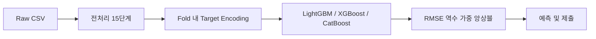
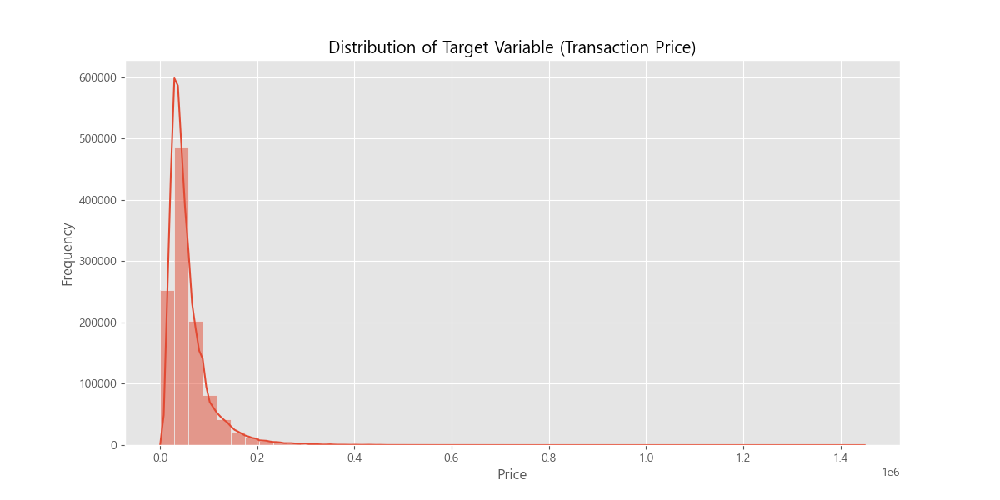
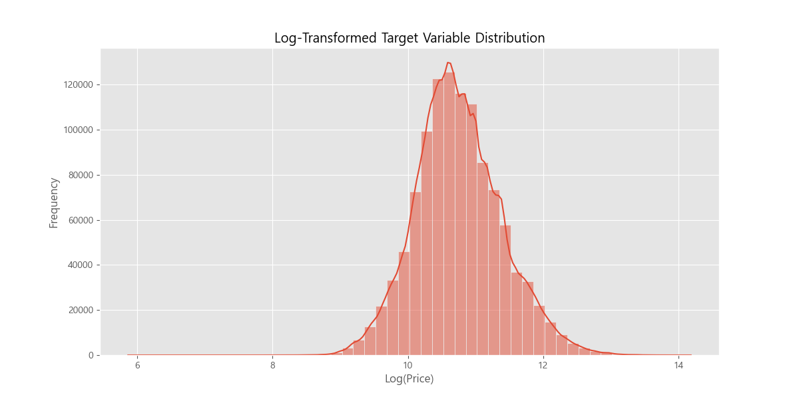
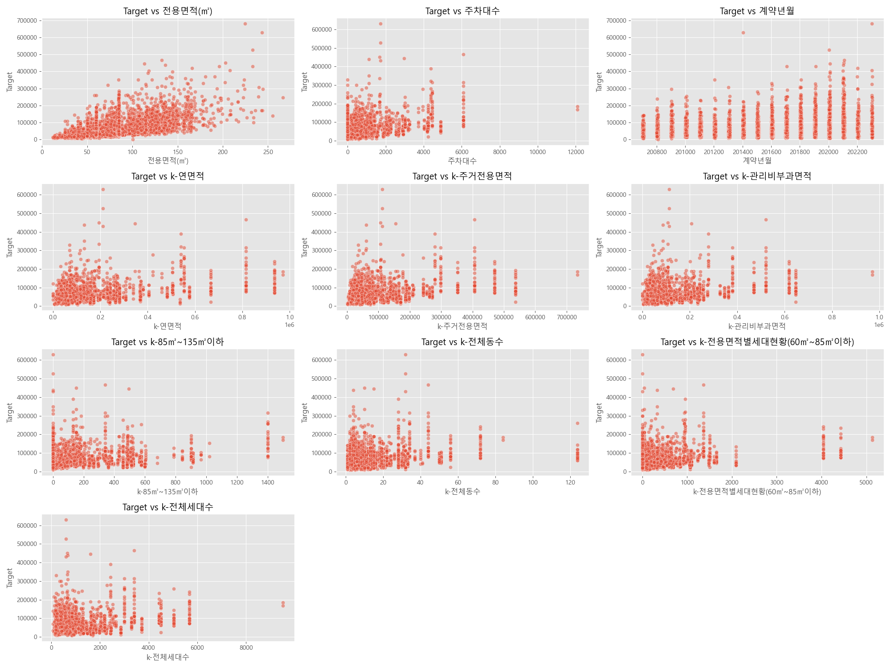
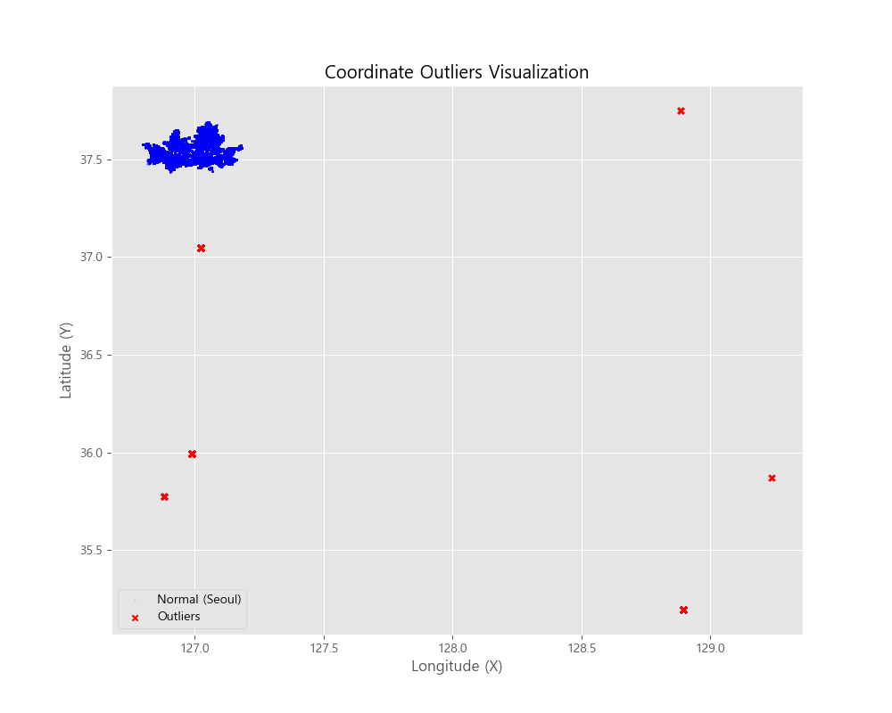
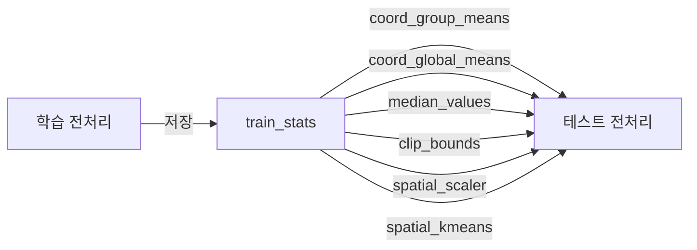
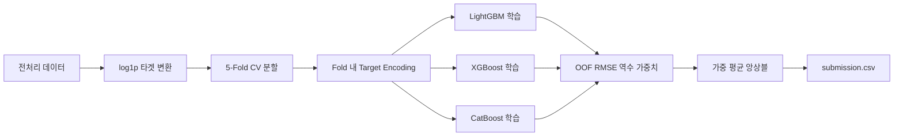

# 서울 아파트 실거래가 예측 — ML 파이프라인

---

## 1. 프로젝트 개요

### 무엇을 예측하는가

서울 아파트 **거래 가격(만원)**을 예측합니다. 예를 들어 target = 124,000이면 **12.4억원**입니다.

### 전체 파이프라인



### 사용 모델 (3-모델 앙상블)

| 모델         | 특징                                  |  GPU 지원  |
| ------------ | ------------------------------------- | :--------: |
| **LightGBM** | Native categorical, GBDT              | O (OpenCL) |
| **XGBoost**  | hist tree method, 한글 컬럼 자동 치환 |  O (CUDA)  |
| **CatBoost** | Native categorical, Pool 기반 학습    |  O (CUDA)  |

- 가중치: OOF RMSE **역수** 기반 자동 계산
- 5-Fold CV + Early Stopping (100 rounds)
- Fold 내 Target Encoding (CV 누수 방지)
- 시간 기반 지수 감쇠 Sample Weight (최근 데이터 우대)

### 디자인 패턴

| 패턴                        | 적용 위치                                | 효과                             |
| --------------------------- | ---------------------------------------- | -------------------------------- |
| **Strategy**                | `PreprocessingStep`, `BaseModel`         | 단계/모델을 독립적으로 교체 가능 |
| **Chain of Responsibility** | `PreprocessingPipeline`                  | Step을 순차 실행, 순서 변경 용이 |
| **Factory Method**          | `Pipeline.create_default()`              | 기본 파이프라인을 한 줄로 생성   |
| **Builder**                 | `pipeline.add_step()`                    | 커스텀 파이프라인 조립           |
| **Mediator**                | `PreprocessingContext`, `TrainingResult` | 단계 간 데이터 공유              |
| **Template Method**         | `Trainer.train_with_cv()`                | 학습/평가 흐름 제어              |

### 실험 이력 (Exp02 ~ Exp08)

| 실험  | 핵심 내용                    | 코드 위치                                                  |
| :---: | ---------------------------- | ---------------------------------------------------------- |
| Exp02 | 건물 연식 + 검증 전략 수정   | `DateAddressFeaturesStep`, `Trainer`                       |
| Exp03 | Building Age 효과 검증       | `DateAddressFeaturesStep`                                  |
| Exp04 | TimeSeriesSplit 도입         | `Trainer._create_cv_splitter()`                            |
| Exp05 | 교통 변수 (지하철/버스)      | `TransitFeaturesStep`                                      |
| Exp06 | 2017+ 최신 데이터 필터링     | `RecentDataFilterStep`                                     |
| Exp07 | 품질 변수 + Feature Diet     | `QualityFeaturesStep`, `LowImportanceFeatureRemovalStep`   |
| Exp08 | 좌표 K-Means 공간 클러스터링 | `SpatialClusteringStep` + `ModelConfig.target_encode_cols` |

---

## 2. 데이터

### 2.1 데이터 규모

| 항목        | 학습 데이터           | 테스트 데이터      |
| ----------- | --------------------- | ------------------ |
| 행 수       | **1,118,822건**       | 9,272건            |
| 컬럼 수     | 52개                  | 51개 (target 제외) |
| 기간        | 2007년 ~ 2023년       | 학습 이후 시점     |
| 학습 실사용 | 2017년 이후만 (Exp06) | 전체               |

### 2.2 외부 데이터

| 파일                 | 내용                    | 용도                                    |
| -------------------- | ----------------------- | --------------------------------------- |
| `bus_feature.csv`    | 서울 버스 정류소 좌표   | 최근접 정류소 거리, 반경 500m 정류소 수 |
| `subway_feature.csv` | 서울 지하철역 좌표·호선 | 최근접 역 거리, 반경 1km 역·호선 수     |

### 2.3 컬럼 구성

| 그룹                     | 주요 컬럼                                           | 결측 수준   |
| ------------------------ | --------------------------------------------------- | ----------- |
| **기본 거래 정보**       | 시군구, 아파트명, 전용면적, 층, 건축년도, 계약년월  | 거의 없음   |
| **위치 좌표**            | 좌표X(경도), 좌표Y(위도)                            | ~78% 결측   |
| **단지 부가(k- 접두사)** | k-관리방식, k-난방방식, k-복도유형, k-전체세대수 등 | 60~80% 결측 |
| **고결측 컬럼**          | 해제사유발생일, 등기신청일자, 단지소개 등           | 80~99% 결측 |

### 2.4 EDA 시각화 (`assets/eda_output/`)

EDA 산출 이미지는 `assets/eda_output/`에 위치합니다. (GitHub에서 정상 표시)

| 파일 | 내용 |
| --- | --- |
| `target_distribution.png` | 타겟(실거래가) 분포 (Right-skewed) |
| `log_target_distribution.png` | log1p 변환 후 분포 |
| `correlation_matrix.png` | 수치형 변수 상관행렬 |
| `top_numeric_correlations.png` | 타겟과 상위 상관계수 |
| `deleted_columns_viz_summary.png` | 제거 컬럼 26개 시각화 |
| `cancelled_transactions_price_boxplot.png` | 취소 거래 가격 분포 |
| `parking_info_price_impact.png` | 주차대수·가격 영향 |
| `cat_k-난방방식.png` | 범주형 k-난방방식 분포 |
| `cat_k-단지분류(아파트,주상복합등등).png` | 범주형 k-단지분류 분포 |
| `outliers/coordinate_outliers_map.png` | 좌표 이상치 지도 |

---

## 3. EDA 핵심 발견 → 전처리 전략

### 3.1 핵심 문제 및 해결

| 문제                |      규모      | 해결 방법                                |
| :------------------ | :------------: | :--------------------------------------- |
| **좌표 결측치**     | 87만 건 (78%)  | API 지오코딩 + Spatial Median Imputation |
| **좌표 이상치**     | 3,137건 (0.3%) | 서울 범위 검증 + 동별 중앙값 대체        |
| **주차대수 결측치** |     약 30%     | RandomForest 기반 예측 모델 (R² 0.86)    |
| **불필요 컬럼**     |      26개      | 상관분석 + 결측률 기반 제거              |

### 3.2 결측치 현황

| 컬럼명           | 결측 개수 |    결측률 |
| :--------------- | --------: | --------: |
| `좌표X`, `좌표Y` |   869,670 | **77.7%** |
| `주차대수`       |  ~330,000 | **29.5%** |
| `k-관리비`       | 1,095,167 | **97.9%** |
| `k-전화번호`     | 1,091,234 | **97.5%** |

### 3.3 타겟 분포 및 상관관계





> 타겟이 Right-skewed → log1p 변환 시 왜도 2.3 → 0.4로 개선




**상위 양의 상관관계**: `전용면적(㎡)` **0.577** > 주차대수 0.348 > 계약년월 0.345 > k-연면적 0.344 …

**음의 상관관계**: `좌표Y` **-0.312** (남북 방향, 강북 < 강남)

**컬럼 제거 기준**: 결측률 ≥80% / 예측 무관 메타데이터 / 다중공선성(k-연면적 vs k-주거전용면적 0.98) → **최종 26개 제거**


### 3.4 좌표 이상치 (Critical)

**서울시 정상 범위**: 경도(X) 126.7~127.3, 위도(Y) 37.4~37.7

- **원인**: API가 동명 오류로 서울이 아닌 타 지역(예: 전북 익산 삼성동) 반환
- **조치**: 이상치 → NaN 변환 후, 해당 법정동 정상 데이터 **중앙값**으로 대체



### 3.5 EDA → 전처리 전략 매핑

| EDA에서 발견한 것                        | 전처리에 반영한 전략                                       |
| ---------------------------------------- | ---------------------------------------------------------- |
| Target이 right-skewed (왜도 2.3→0.4)     | **log1p 변환** (Step 15)                                   |
| 결측 80% 이상 컬럼 다수                  | **80% 임계값**으로 제거, k-\* 피처(60~70%)는 보존 (Step 2) |
| 좌표 결측 ~78%이지만 위치↔가격 상관 높음 | **Vworld→Naver→Kakao API + 동별 Spatial Median** (Step 6)  |
| 아파트명 고유값 20,000+                  | One-Hot 불가 → **Fold 내 Target Encoding** (trainer.py)    |
| 2020년 이후 급격한 가격 상승             | **시간 기반 Sample Weight** + **2017+ 필터링** (Step 4)   |
| 전용면적·층이 target과 상관 높음         | **교호작용 피처** 생성 (Step 13)                           |
| 강남·서초·송파 고가 집중                 | **좌표 K-Means 클러스터링** → 생활권 평균가격 (Step 10)    |
| 교통 편의성과 가격 상관                  | **BallTree 기반 교통 피처** (Step 9)                       |
| 과거 데이터의 유령 지하철 문제           | **2017년 이후 데이터만 학습** (Step 4)                     |

### 3.6 전처리 결과 (최종 데이터 품질)

| 지표          |    Before |                       After |
| :------------ | --------: | --------------------------: |
| 총 컬럼 수    |      48개 |                        22개 |
| 좌표 결측치   | 869,670건 |                     **0건** |
| 좌표 이상치   |   3,137건 |                     **0건** |
| 주차대수 결측 |      ~30% | **0건** (RandomForest 예측) |

---

## 4. 전처리 파이프라인 — 15단계

```mermaid
graph LR
    A[Raw CSV] --> A0[1.취소+Target]
    A0 --> B[2.고결측+타입+컬럼명]
    B --> C[3.날짜/주소]
    C --> D[4.시간+2017+]
    D --> E[5.범주형+결측]
    E --> F[6.좌표]
    F --> G[7.공간]
    G --> H[8.주차 RF]
    H --> I[9.교통]
    I --> J[10.클러스터]
    J --> K[11.결측 대체]
    K --> L[12.주차/품질]
    L --> M[13.교호작용]
    M --> N[14.이상치+Diet]
    N --> O[15.log1p]
```



### Step 1. 취소 거래 필터링 + Target 분리


| 데이터     | 행 제거 | 컬럼 제거 | 이유                                   |
| ---------- | :-----: | :-------: | -------------------------------------- |
| **학습**   |    O    |     O     | 취소 거래가 학습 노이즈 유발 방지      |
| **테스트** |    X    |     O     | 평가 시스템이 전체 행에 대한 예측 요구 |

- `target` 컬럼을 `y_train`으로 분리, 나머지를 `X_train`으로 사용

### Step 2. 고결측 컬럼 제거 + 타입 변환 + 컬럼명 정리

**고결측 제거 (임계값 80%)**: 0~10% 보존 / 60~70% k-\* 보존 / **80~99% 제거** (좌표X,Y는 예외)

**타입 변환**: `본번`, `부번`, `k-전체동수`, `주차대수` 등 Float → Int64

**컬럼명 정리**: LightGBM 호환을 위해 `{}[]"\\,()=` → `_` 치환

### Step 3. 날짜/주소 파생 피처

| 피처 | 산식 |
| ---- | ---- |
| 계약일자, 구, 동, 건물나이 | 계약년월×100+계약일, 시군구 토큰, 계약연도−건축년도 |

### Step 4. 시간 파생 + 2017+ 필터링

**시간 파생**: 계약년, 계약월, 계약분기, 계약반기, 계약월_sin/cos

**2017+ 필터링**: `계약년 >= 2017` — 유령 지하철·인플레이션 노이즈 제거. 테스트 데이터는 변경 없음.

### Step 5. 범주형 식별 + 결측 지표

- **범주형**: dtype object 또는 고유값 비율 < 10% & < 100개
- **결측 지표**: `missing_count = X.isnull().sum(axis=1)` (데이터 부실 단지 정보)

.png) 

### Step 6. 좌표 보간 — 3단계 하이브리드 접근법

**Phase 1: 중복 제거** — 87만 건 → 8,200개 고유 주소로 압축 후 API 호출

**Phase 2: API 순차 호출**

| 순서 | API                 | 특징                     |
| ---- | ------------------- | ------------------------ |
| 1차  | **Vworld (국토부)** | 지적도 기반, 정확도 최고 |
| 2차  | **Naver Maps**      | 상업 POI 강점            |
| 3차  | **Kakao Local**     | 주소 검색 보완           |

**성공률**: 8,200개 중 8,072개 (98.4%)

**Phase 3: Spatial Median Imputation**

- API 실패 128개 + 좌표 이상치 3,137건 → **동(Dong)별 정상 데이터 중앙값**으로 보간
- 가설: 같은 법정동 아파트는 지리적으로 인접 → 중앙값 대체 시 오차 수백 미터 이내

### Step 7. 공간 파생 피처 (랜드마크 거리)

| 피처            | 기준점              | 의미                    |
| --------------- | ------------------- | ----------------------- |
| `dist_강남역`   | (127.0276, 37.4979) | 강남 중심까지 거리 (km) |
| `dist_서울시청` | (126.9780, 37.5665) | 도심 접근성 (km)        |
| `dist_여의도`   | (126.9246, 37.5219) | 여의도 접근성 (km)      |

### Step 8. 주차대수 결측치 처리 (RandomForest)

결측률 약 30%인 주차대수를 **RandomForest Regressor**로 예측 (R² 0.86).

| 방법             |  R² Score |
| :--------------- | --------: |
| 평균/중앙값 대체 | 0.12~0.15 |
| KNN              |      0.64 |
| **RandomForest** |  **0.86** |

**학습 변수**: `전용면적(㎡)`, `건축년도`, `좌표X`, `좌표Y`, `Gu_encoded`, `전체세대수`

**Feature Importance**: 전용면적 45.2% > 전체세대수 28.7% > 건축년도 12.3% > 좌표 9.8%


### Step 9. 교통 피처 — BallTree 기반 (Exp05)

BallTree + joblib 병렬 청크 처리로 대규모 좌표 데이터를 고속 탐색합니다.

| 피처                  | 의미                               |
| --------------------- | ---------------------------------- |
| `nearest_subway_dist` | 가장 가까운 지하철역 거리 (km)     |
| `subway_count_1km`    | 반경 1km 내 지하철역 수            |
| `subway_lines_1km`    | 반경 1km 내 지하철 호선 수         |
| `nearest_bus_dist`    | 가장 가까운 버스정류소 거리 (km)   |
| `bus_count_500m`      | 반경 500m 내 버스정류소 수         |
| `is_real_coord`       | 좌표가 실제값(1)인지 보간값(0)인지 |

### Step 10. 공간 클러스터링 — K-Means (Exp08)

행정구역(동) 경계를 넘어 **실제 좌표 기반 '생활권'** 을 정의합니다.

| 항목      | 값                                                 |
| --------- | -------------------------------------------------- |
| 알고리즘  | K-Means (K=150)                                    |
| 입력      | 표준화된 좌표 (StandardScaler → fit on train)      |
| 생성 피처 | `coord_cluster` (생활권 ID)                        |
| 후속 활용 | Fold 내 TE → `te_coord_cluster` (생활권 평균 가격) |

> `coord_cluster_mean_price`는 실험에서 **변수 중요도 압도적 1위**를 기록.
> "어느 생활권에 속해 있는가"가 가격 결정의 가장 핵심적인 요소.

**데이터 누수 방지**:

- 학습 데이터에서 StandardScaler + KMeans를 **fit**
- 테스트 데이터에는 학습 기준 scaler/kmeans를 **transform/predict**

### Step 11. 결측값 대체 (Median Imputer)

| 유형       | 방법                   | 이유                                                       |
| ---------- | ---------------------- | ---------------------------------------------------------- |
| **범주형** | `"미상"`               | 결측을 독립 범주로 취급                                    |
| **수치형** | **Median** (학습 기준) | 트리 모델은 결측 자체 처리 가능, 파생 피처 NaN 전파만 방지 |

> 학습 데이터에서 계산한 Median을 테스트 데이터에도 **동일 적용** (누수 방지)

### Step 12. 주차/품질 피처

| 피처                    | 산식                            | 의미                  |
| ----------------------- | ------------------------------- | --------------------- |
| `parking_per_household` | `주차대수 / (k-전체세대수 + ε)` | 세대당 주차 여유 공간 |

**단지 품질 (Exp07)**

절대적 수치를 **상대적 품질 지표**로 변환합니다.

| 피처             | 산식                                  | 의미                 |
| ---------------- | ------------------------------------- | -------------------- |
| `unit_area_avg`  | `k-주거전용면적 / (k-전체세대수 + ε)` | 단지 고급화 정도     |
| `log_전체세대수` | `log1p(k-전체세대수)`                 | 세대수 비선형 스케일 |
| `log_연면적`     | `log1p(k-연면적)`                     | 연면적 비선형 스케일 |

### Step 13. 교호작용 / 도메인 피처

**교호작용 피처**:

| 피처              | 산식                              | 근거                |
| ----------------- | --------------------------------- | ------------------- |
| `면적x층`         | `전용면적 × 층`                   | 고층 대형 프리미엄  |
| `면적_건물나이비` | `전용면적 / (건물나이 + 1)`       | 신축 대형의 가치    |
| `log_전용면적`    | `log1p(전용면적)`                 | 비선형 면적 효과    |
| `전용면적_sq`     | `전용면적²`                       | 면적 가속 가격 상승 |
| `층_건물나이비`   | `층 / (건물나이 + 1)`             | 신축 고층 프리미엄  |
| `동당세대수`      | `k-전체세대수 / (k-전체동수 + 1)` | 단지 밀집도         |

**도메인 피처**:

| 피처                   | 조건                                                  | 의미                 |
| ---------------------- | ----------------------------------------------------- | -------------------- |
| `is_rebuild_candidate` | `건물나이 ≥ 30년`                                     | 재건축 기대 프리미엄 |
| `층구간`               | 저층(1~3) / 중층(4~10) / 고층(11~20) / 최상층(21+)    | 비선형 층 효과       |
| `면적대`               | 소형(~59㎡) / 국민평형(~84) / 중형(~135) / 대형(135+) | 시장 세그먼트        |

### Step 14. 이상치 클리핑 + Feature Diet

**이상치 클리핑**: 수치형 IQR×3.0 / Target 퍼센타일 0.1%~99.9% (학습 기준 테스트 동일 적용)

**Feature Diet (Exp07)**

두 가지 제거 대상:

| 구분             | 제거 대상                                               | 이유                                          |
| ---------------- | ------------------------------------------------------- | --------------------------------------------- |
| **저중요도**     | `관리비 업로드`, `k-난방방식`, `경비비관리형태` 등 10개 | 중요도 < 50                                   |
| **Feature Diet** | `계약일`, `주차대수`                                    | 파생 피처로 대체됨 (parking_per_household 등) |

### Step 15. Target 로그 변환 (log1p)

| 변환 전                     | 변환 후                 |
| --------------------------- | ----------------------- |
| 1,000만 ~ 200억원 (4자릿수) | 약 11 ~ 19 (좁은 범위)  |
| 고가 오차가 손실 지배       | **전 가격대 균형 학습** |
| 왜도 높음                   | **정규분포에 가까워짐** |

> 예측 시 `np.expm1()`로 역변환하여 원래 가격으로 복원

---

## 5. 학습/테스트 일관성 — 데이터 누수 방지

전처리에서 **가장 주의한 점**입니다.

### train_stats 딕셔너리



| 저장 항목            | 용도                                                             |
| -------------------- | ---------------------------------------------------------------- |
| `coord_group_means`  | 시군구/동별 좌표 평균·중앙값 → 테스트 좌표 보간 (Spatial Median) |
| `coord_global_means` | 전체 좌표 평균 → 새 시군구/동 폴백                               |
| `median_values`      | 수치형 중앙값 → 테스트 결측 대체                                 |
| `clip_bounds`        | IQR 클리핑 범위 → 테스트 동일 적용                               |
| `spatial_scaler`     | StandardScaler → 테스트 좌표 표준화                              |
| `spatial_kmeans`     | KMeans 모델 → 테스트 클러스터 할당                               |

---

## 6. Fold 내 Target Encoding

### 왜 전처리가 아닌 Fold 내부에서?

전처리 파이프라인에서 TE를 수행하면 **CV 데이터 누수**가 발생합니다.
Fold 내부에서 학습 fold 기준으로만 encoding map을 생성하여 완벽히 방지합니다.

### 인코딩 공식 (Bayesian Smoothing)

```
te_value = (count × group_mean + α × global_mean) / (count + α)
```

- `α = 100`: 건수가 적을수록 전역 평균에 수렴

### 대상 컬럼 (7개 → 14개 피처 생성)

| 원본 컬럼         | 생성 피처                                        | 의미                 |
| ----------------- | ------------------------------------------------ | -------------------- |
| 아파트명          | `te_아파트명`, `freq_아파트명`                   | 단지별 가격/거래량   |
| 도로명            | `te_도로명`, `freq_도로명`                       | 도로 위치별 가격     |
| 번지              | `te_번지`, `freq_번지`                           | 번지별 가격          |
| 시군구            | `te_시군구`, `freq_시군구`                       | 시군구별 가격        |
| 구                | `te_구`, `freq_구`                               | 구별 가격            |
| 동                | `te_동`, `freq_동`                               | 동별 가격            |
| **coord_cluster** | **`te_coord_cluster`**, **`freq_coord_cluster`** | **생활권 평균 가격** |

---

## 7. 모델링 — 3-모델 앙상블

### 7.1 학습 파이프라인



### 7.2 하이퍼파라미터

| 파라미터        | LightGBM | XGBoost | CatBoost |
| --------------- | -------- | ------- | -------- |
| n_estimators    | 5,000    | 5,000   | 5,000    |
| learning_rate   | 0.05     | 0.05    | 0.03     |
| max_depth       | -1       | 8       | 6        |
| num_leaves      | 63       | -       | -        |
| subsample       | 0.8      | 0.8     | -        |
| reg_alpha / L1  | 0.1      | 0.1     | -        |
| reg_lambda / L2 | 1.0      | 1.0     | 5.0      |
| early_stopping  | 100      | 100     | 100      |

### 7.3 CV 전략

| 전략                | 설정값                     | 용도                                  |
| ------------------- | -------------------------- | ------------------------------------- |
| **Shuffle K-Fold**  | `cv_strategy="kfold"`      | 기본 (안정적 성능 평가)               |
| **TimeSeriesSplit** | `cv_strategy="timeseries"` | 시계열 유효성 검증                    |
| **Sample Weight**   | `use_sample_weight=True`   | 최근 데이터에 높은 가중치 (지수 감쇠) |

### 7.4 앙상블 가중치

```python
weight[model] = (1 / RMSE[model]) / Σ(1 / RMSE[all_models])
```

OOF RMSE가 낮은 모델에 더 높은 가중치를 자동 부여합니다.

---

## 8. 전처리 의사결정 요약표

| 판단          | 선택                                             | 기각한 대안          | 근거                                  |
| ------------- | ------------------------------------------------ | -------------------- | ------------------------------------- |
| 데이터 기간   | **2017+ 필터링** (Exp06)                         | 전체 사용            | 유령 지하철/인플레이션 노이즈 제거    |
| 고결측 기준   | **80%**                                          | 50%, 70%             | k-\* 피처(60~70%)를 보존              |
| 좌표 결측     | **Vworld→Naver→Kakao API + 동별 Spatial Median** | 행 제거, 전체 평균만 | 3단계 API + 동별 중앙값으로 100% 복원 |
| 주차대수 결측 | **RandomForest 예측** (R² 0.86)                  | 평균/중앙값, KNN     | 비선형 관계 포착, 분산 86% 설명       |
| 위치 인코딩   | **K-Means 좌표 클러스터** (Exp08)                | 행정구역(동)만 사용  | 비선형 입지 프리미엄 포착             |
| 교통 피처     | **BallTree 거리** (Exp05)                        | 좌표만 사용          | 교통 편의성이 가격 핵심 요인          |
| 품질 지표     | **상대적 비율** (Exp07)                          | 절대 수치만 사용     | 세대당 주차수가 총 주차수보다 유의미  |
| Feature Diet  | **원본 컬럼 제거** (Exp07)                       | 모두 유지            | 파생 피처가 대체, 과적합 방지         |
| 수치형 결측   | **Median Imputer**                               | KNN Imputer          | 트리 모델이 결측 자체 처리, 속도 우선 |
| Target 이상치 | **퍼센타일 0.1%~99.9%**                          | IQR × 2.0            | skewed에서 IQR 과다 제거              |
| Target 변환   | **log1p**                                        | 없음, sqrt           | 4자릿수 범위 균등화                   |
| TE 위치       | **Fold 내부**                                    | 전처리 단계          | CV 데이터 누수 완벽 방지              |
| 모델          | **3-모델 앙상블**                                | 단일 LightGBM        | 모델 다양성으로 일반화 향상           |

---

## 9. 파생 피처 전체 목록 (50+개)

### 전처리 단계 생성 피처 (36개)

| Step | 생성 피처                                                                                                                              |  개수  |
| ---- | -------------------------------------------------------------------------------------------------------------------------------------- | :----: |
| 3    | `계약일자`, `구`, `동`, `건물나이`                                                                                                     |   4    |
| 4    | `계약년`, `계약월`, `계약분기`, `계약반기`, `계약월_sin`, `계약월_cos`                                                                 |   6    |
| 5    | `missing_count`                                                                                                                        |   1    |
| 7    | `dist_강남역`, `dist_서울시청`, `dist_여의도`                                                                                          |   3    |
| 9    | `nearest_subway_dist`, `subway_count_1km`, `subway_lines_1km`, `nearest_bus_dist`, `bus_count_500m`, `is_real_coord`                   |   6    |
| 10   | `coord_cluster`                                                                                                                        |   1    |
| 12   | `parking_per_household`, `unit_area_avg`, `log_전체세대수`, `log_연면적`                                                              |   4    |
| 13   | `면적x층`, `면적_건물나이비`, `log_전용면적`, `전용면적_sq`, `층_건물나이비`, `동당세대수`, `is_rebuild_candidate`, `층구간`, `면적대` |   9    |
|      | **소계**                                                                                                                               | **34** |

### Fold 내 Target Encoding 피처 (14개)

| 대상 컬럼                                             | te\_ 피처 | freq\_ 피처 |
| ----------------------------------------------------- | --------- | ----------- |
| 아파트명, 도로명, 번지, 시군구, 구, 동, coord_cluster | 7개       | 7개         |
|                                                       | **소계**  | **14**      |

> **총 파생 피처: 34 + 14 = 48개** (원본 피처 포함 시 50+ 컬럼)

---

## 10. 제출 (Submission)

### 제출 파일 생성 흐름


### 출력 파일

| 파일                       | 위치       | 설명                          |
| -------------------------- | ---------- | ----------------------------- |
| `submission.csv`           | `outputs/` | 제출용 (9,272건, target 정수) |
| `feature_importance_*.csv` | `outputs/` | 모델별 피처 중요도            |
| `*.log`                    | `outputs/` | 학습 전체 로그                |

> **주의**: `target` 컬럼은 반드시 **정수형**이어야 합니다 (float 불가).
> Step 1에서 테스트 데이터는 행을 유지하므로 전체 9,272건에 대해 예측 가능.

---

## 11. 설정 관리

모든 설정은 **dataclass**로 중앙 관리됩니다. 코드 내 매직넘버 없이 설정만 변경하면 전체 파이프라인에 반영됩니다.

| 설정 클래스           | 파일                          | 주요 필드                                                          |
| --------------------- | ----------------------------- | ------------------------------------------------------------------ |
| `PreprocessingConfig` | `src/preprocessing/config.py` | `recent_data_year_from`, `spatial_n_clusters`, `feature_diet_cols` |
| `ModelConfig`         | `src/modeling/config.py`      | `cv_strategy`, `target_encode_cols`, `ensemble_models`             |
