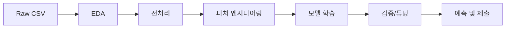
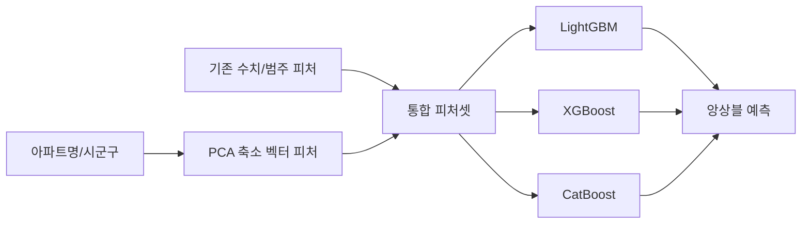

# 아파트 가격 예측 머신러닝 프로젝트 전략

## 0. 팀 일정 및 운영 (회의 합의 사항 반영)

우선 목표는, 경진대회 개요랑 데이터셋 아이디어를 공유하고, 각자 나온 결과물을 점검하면서 인사이트를 챙기는 거예요. 그다음 진행 방식을 팀 단위로 통일해서 프로젝트 감을 같이 잡고, 좋은 결과도 내되 이번 프로젝트에서 배우는 걸 최대한 많이 가져가자는 거죠.

코어타임에는 꼭 구체적인 결과물을 들고 모이기로 했어요. 그때마다 개개인 결과에서 경진대회를 어떻게 보는지 점검하고 인사이트 나누는 시간 갖는 식으로요. 그리고 지금 organ이랑 repo가 여기저기 흩어져 있으니까, 진행 과정이랑 방식은 팀 단위로 통일하는 게 필요해요.

일정은 이렇게 가져가기로 했습니다. 목요일까지는 주어진 데이터셋으로 EDA랑 전처리 하고, 시도해볼 만한 파생변수(Feature Engineering)를 고민해 보는 걸로요. 퀄리티가 완벽하지 않아도 괜찮고, 주말 동안 더 고민해서 다음 주 화요일까지는 어느 정도 가닥 잡고, 그다음부터는 baseline 모델 구축하는 쪽으로 가면 될 것 같아요. EDA·전처리 이후 단계는 각자 따로가 아니라 팀 단위로 진행해서 프로젝트 감 잡는 걸로 했고, 고급 모델이랑 앙상블은 경진대회 하는 동안 계속 같이 고민해 보기로 했어요.

- 데이터 : `https://aistages-api-public-prod.s3.amazonaws.com/app/Competitions/000420/data/data.tar`
- 베이스 라인 : `https://aistages-api-public-prod.s3.amazonaws.com/app/Competitions/000420/data/code.tar`
- 원격서버 : 환경변수 참조 (`$SSH_KEY`, `$SSH_HOST`, `$SSH_PORT`, `$SSH_USER`) — 상세 설정은 `scripts/run_remote_gpu.sh` 참고

---

## 1. 데이터 개요

### 1.1 보유 데이터 (`assets/data/`)

| 파일                      | 설명                      | 주요 컬럼                                                                 |
| ------------------------- | ------------------------- | ------------------------------------------------------------------------- |
| **train.csv**             | 학습용 아파트 거래 데이터 | 시군구, 전용면적, 계약년월, 층, 건축년도, 좌표X/Y, **target** 등 60+ 컬럼 |
| **test.csv**              | 예측 대상 (target 없음)   | train과 동일 스키마, target 제외                                          |
| **sample_submission.csv** | 제출 형식                 | `target` 컬럼만 (예측값 순서대로)                                         |
| **bus_feature.csv**       | 버스 정류소 정보          | 노드 ID, 정류소명, X좌표, Y좌표, 정류소 타입                              |
| **subway_feature.csv**    | 지하철역 정보             | 역사\_ID, 역사명, 호선, 위도, 경도                                        |

### 1.2 타깃 변수

target은 아파트 거래 가격이고, 단위는 만 원으로 보면 돼요. 예를 들어 124000이면 12.4억 원 이런 식이에요. 회귀 문제라서 RMSE, MAE, R² 같은 걸로 평가하면 됩니다.

### 1.3 `k-세대타입(분양형태)` 컬럼 — target 의미 및 처리 방안

이 컬럼에는 분양, 임대, 기타 세 가지가 들어 있고, 결측(공란)도 꽤 많아요. train 데이터 상위 30만 행 기준으로 보면 분양이 약 5만 5천 건, 기타가 1만 3천 건 정도, 임대는 524건 정도고, 결측이 23만 건 정도 됩니다. target 평균을 보면 분양이 약 7만 8천(만 원), 기타가 약 11만 6천, 임대가 약 5만 4천으로, 말씀하신 것처럼 임대가 분양보다 낮게 나와요.

target이 뭘 의미하냐면요. 분양이면 매매 거래가니까 target은 그냥 매매가(만 원)로 보면 되고, 임대는 매매가가 아니라 전세보증금이나 임대 쪽 금액(만 원)으로 보는 게 자연스러워요. 그래서 분양보다 숫자가 낮게 나오는 게 맞고, 같은 “만 원” 단위로 기록된 값이라고 보면 됩니다. 기타는 매매·임대 말고 다른 거래 형태가 섞인 걸로 보면 되고, 결측은 미입력이 많아서 “미상” 같은 걸로 묶어서 범주형 피처로만 쓰는 게 안전해요.

처리하는 방법은, 이 컬럼을 빼지 말고 그대로 범주형 피처로 두는 걸 추천해요. 결측은 “미상”으로 통합해서 넣으면 되고, 모델이 분양/임대/기타에 따라 target 수준이 다르다는 걸 스스로 배우게 할 수 있어요. 임대 건수가 적다고 해서 학습에서 아예 빼는 건 비추예요. test에 임대가 있으면 예측해야 하니까요. 타입별로 모델을 따로 만드는 건 임대 샘플이 적어서 부담이 있고, 하나의 모델에 타입을 피처로 넣는 쪽이 먼저 해 보기 좋아요. 정리하면, 임대의 target은 전세보증금(또는 임대 관련 금액, 만 원)으로 해석하고, 다 같은 만 원 단위로 예측하면 되고, 컬럼은 그대로 두고 범주형 인코딩만 해서 쓰면 됩니다.

---

## 2. 프로젝트 파이프라인



---

## 3. 단계별 전략

### 3.1 탐색적 데이터 분석 (EDA)

- **목표**: 결측·이상치·분포·상관관계 파악
- **주요 확인 사항**
  - `target` 분포 (왜도, 로그 변환 필요 여부)
  - 결측 비율이 높은 컬럼 (예: 해제사유발생일, 등기신청일자, 단지소개 등)
  - 범주형: 시군구, 아파트명, k-관리방식, k-난방방식, k-복도유형 등
  - 수치형: 전용면적, 층, 건축년도, 계약년월, 좌표X/Y, 주차대수, 세대수 등
  - 시군구·아파트명별 거래 수, 가격 분포
- **산출물**: `notebooks/eda.ipynb` 또는 `scripts/eda.py` + 요약 리포트

### 3.2 데이터 전처리

- **결측 처리**
  - 결측 비율이 매우 높은 컬럼: 제거 또는 “미상” 등 별도 카테고리
  - 수치형: 중앙값/평균 대체 또는 예측 모델로 대체(선택)
- **이상치**
  - `target`, 전용면적, 층 등에 대한 IQR/표준편차 기반 클리핑 또는 로그 변환
- **인코딩**
  - 범주형: One-Hot 또는 Target Encoding (과적합 방지용 스무딩)
  - 고카디널리티(아파트명 등): Target Encoding 또는 빈도/요약 통계로 대체
- **날짜/시간**
  - 계약년월 → 연도, 월, 분기 등 파생
  - 건축년도 → 경과연수(현재 기준 또는 계약년도 기준)
- **학습/검증 분할**
  - 시계열이 있다면 시간 기준 분할 (예: 최근 N개월을 검증)
  - 랜덤 분할 시 K-Fold Cross Validation으로 안정성 확인

### 3.3 피처 엔지니어링

- **기본 피처**
  - 전용면적, 층, 건축년도(또는 경과연수), 계약년월(또는 연/월)
  - 시군구(또는 시/구만 분리), 동 단위 추출
- **위치 기반 피처 (좌표X, 좌표Y 활용)**
  - **버스**: 각 거래 좌표에서 가장 가까운 버스 정류소까지 거리, 반경 500m 내 정류소 수
  - **지하철**: 가장 가까운 역까지 거리, 반경 1km 내 역 개수, 호선 수
  - 거리 계산: Haversine 또는 유클리드(위도·경도 스케일 조정 후)
- **단지/규모**
  - k-전체동수, k-전체세대수, 주차대수, 건축면적
  - 주차대수/세대수 비율 등
- **파생**
  - 면적당 가격(학습 시는 사용 안 하고 검증용), 층/전체층 비율(해당 정보 있을 경우)
- **피처 선택**
  - 상관계수, VIF, 모델 기반 중요도(Random Forest, XGBoost feature importance)로 불필요 피처 제거

### 3.4 모델 전략

- **1단계: 베이스라인**
  - Ridge/Lasso 회귀 또는 Random Forest로 빠른 파이프라인 구축
  - 전처리 + 기본 피처만으로도 성능 확인
- **2단계: 부스팅**
  - XGBoost, LightGBM, CatBoost 중 1~2개 사용
  - 하이퍼파라미터: 그리드/랜덤 서치 또는 Optuna
- **3단계: 앙상블(선택)**
  - 여러 모델 예측값의 평균 또는 스태킹
  - 과적합 방지를 위해 CV 기반 메타 피처 생성
- **평가**
  - RMSE (또는 대회에서 지정한 메트릭) 최소화
  - target이 왜도가 크면 **로그 변환 후 학습 → 예측값 exp 복원**으로 RMSE 개선 가능

### 3.5 검증 및 튜닝

- K-Fold CV로 평균 RMSE·표준편차 확인
- 시간 순서가 있으면 Time Series Split 적용
- 조기 종료(Early Stopping)로 과적합 방지

### 3.6 예측 및 제출

- test.csv에 대해 동일 전처리·피처 적용
- bus/subway 피처는 test 좌표로 동일 방식 계산
- sample_submission.csv 형식에 맞춰 `target`만 저장 후 제출

---

## 4. 폴더 구조 제안

```
house-price-prediction-team-2/
├── assets/
│   └── data/           # train, test, bus_feature, subway_feature, sample_submission
├── docs/
│   └── STRATEGY.md     # 본 전략 문서
├── notebooks/          # EDA, 실험용 노트북
├── src/
│   ├── data/           # 전처리, 피처 연산 (버스/지하철 거리 등)
│   ├── features/       # 피처 파이프라인
│   ├── models/         # 학습, 예측, CV
│   └── submission/     # 제출 파일 생성
├── scripts/            # 실행 스크립트 (train.py, predict.py 등)
├── tests/              # 단위 테스트
├── requirements.txt    # Python 의존성
└── README.md
```

---

## 5. 리스크 및 대응

| 리스크                           | 대응                                                      |
| -------------------------------- | --------------------------------------------------------- |
| 결측이 많은 컬럼으로 인한 노이즈 | EDA 후 제거 또는 보수적 대체                              |
| 아파트명 등 고유값 많음          | Target Encoding + 스무딩 또는 집계 통계만 사용            |
| train/test 기간·지역 분포 차이   | 시군구·계약년월 분포 비교, 필요 시 도메인 반영            |
| 좌표 결측                        | 해당 행 제외 또는 시군구 중심 좌표 대체 후 거리 피처 계산 |
| 과적합                           | 정규화, CV, Early Stopping, 피처 수 축소                  |


