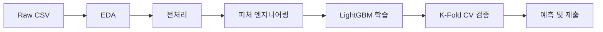
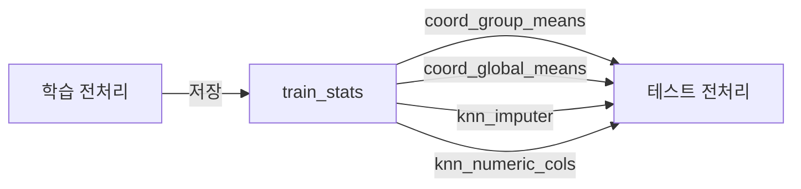
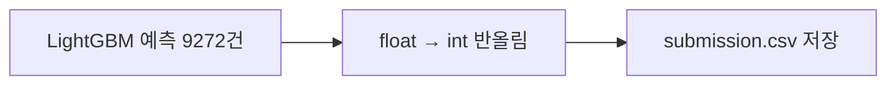

# 아파트 가격 예측 — EDA & 전처리 & LightGBM 모델링

---

## 1. 프로젝트 개요

### 무엇을 예측하는가

아파트 **거래 가격(만원)**을 예측합니다. 예를 들어 target = 124,000이면 **12.4억원**입니다.

### 전체 파이프라인



### 사용 모델

**LightGBM** — Gradient Boosting Decision Tree 기반 회귀 모델

- Native categorical feature 지원으로 별도 인코딩 불필요
- GBDT 부스팅, Early Stopping으로 과적합 방지
- 5-Fold CV RMSE: **0.069537 (±0.000709)**

### 디자인 패턴

| 패턴                        | 적용 위치                                | 효과                             |
| --------------------------- | ---------------------------------------- | -------------------------------- |
| **Strategy**                | `PreprocessingStep`, `BaseModel`         | 단계/모델을 독립적으로 교체 가능 |
| **Chain of Responsibility** | `PreprocessingPipeline`                  | Step을 순차 실행, 순서 변경 용이 |
| **Factory Method**          | `Pipeline.create_default()`              | 기본 파이프라인을 한 줄로 생성   |
| **Builder**                 | `pipeline.add_step()`                    | 커스텀 파이프라인 조립           |
| **Mediator**                | `PreprocessingContext`, `TrainingResult` | 단계 간 데이터 공유              |
| **Template Method**         | `Trainer.train_with_cv()`                | 학습/평가 흐름 제어              |

---

## 2. 프로젝트 구조

```text
house-price-prediction/
├── run.py                  # 전처리 실행 엔트리포인트
├── run_train.py            # LightGBM 학습 실행 엔트리포인트
├── pyproject.toml          # 의존성 및 프로젝트 설정 (uv)
├── src/
│   ├── preprocessing/      # 전처리 패키지
│   │   ├── __init__.py
│   │   ├── context.py      # PreprocessingContext (Mediator)
│   │   ├── pipeline.py     # PreprocessingPipeline (Chain of Responsibility)
│   │   ├── steps.py        # 14개 전처리 Step (Strategy)
│   │   └── run_preprocessing.py
│   └── modeling/           # 모델 학습 패키지
│       ├── __init__.py
│       ├── base.py         # BaseModel (Strategy 인터페이스), TrainingResult
│       ├── config.py       # ModelConfig (하이퍼파라미터 중앙 관리)
│       ├── models.py       # LightGBMModel (Concrete Strategy)
│       ├── trainer.py      # Trainer (K-Fold CV, RMSE 평가)
│       ├── run_training.py # 학습 파이프라인 실행
│       └── __main__.py     # python -m modeling 지원
├── notebooks/
│   ├── preprocessing.ipynb # 원본 전처리 노트북
│   └── data/               # 전처리 결과 CSV
├── outputs/                # 모델 출력 (submission, 피처 중요도)
└── assets/data/            # 원본 데이터 (train.csv, test.csv)
```

---

## 3. 실행 방법

### 전처리

```bash
cd house-price-prediction
uv run python run.py --skip-eda      # EDA 건너뛰고 전처리만
uv run python run.py                 # EDA + 전처리
```

### LightGBM 학습

```bash
uv run python run_train.py                   # 5-Fold CV (기본)
uv run python run_train.py --n-splits 10     # 10-Fold CV
uv run python run_train.py --save-submission # submission.csv 생성
```

---

## 4. 데이터 살펴보기

### 4.1 데이터 규모

| 항목    | 학습 데이터     | 테스트 데이터      |
| ------- | --------------- | ------------------ |
| 행 수   | **1,118,822건** | 9,272건            |
| 컬럼 수 | 52개            | 51개 (target 제외) |
| 기간    | 2007년 ~ 2023년 | 학습 이후 시점     |

### 4.2 컬럼 구성 — 3개 그룹

| 그룹                     | 주요 컬럼                                           | 결측 수준   |
| ------------------------ | --------------------------------------------------- | ----------- |
| **기본 거래 정보**       | 시군구, 아파트명, 전용면적, 층, 건축년도, 계약년월  | 거의 없음   |
| **위치 좌표**            | 좌표X(경도), 좌표Y(위도)                            | ~78% 결측   |
| **단지 부가(k- 접두사)** | k-관리방식, k-난방방식, k-복도유형, k-전체세대수 등 | 60~80% 결측 |
| **고결측 컬럼**          | 해제사유발생일, 등기신청일자, 단지소개 등           | 80~99% 결측 |

> **핵심 포인트**: 데이터의 절반 이상 컬럼이 60% 넘는 결측을 가지고 있음.
> "어떤 컬럼을 살리고 어떤 컬럼을 버릴 것인가"가 전처리의 가장 큰 과제.

---

## 5. EDA — 데이터에서 발견한 것들

### 5.1 Target 분포: 오른쪽으로 길게 늘어진 꼬리

- **범위**: 약 1,000만원 ~ 200억원 **(4자릿수 스케일)**
- **왜도(skewness)**: 높음 (right-skewed)
- 대부분의 거래가 1~7억 구간에 몰려 있고, 10억 이상 고가 거래는 소수

### 5.2 세대타입별 Target 의미가 다르다

`k-세대타입(분양형태)` 컬럼 분석 결과, **target의 의미 자체가 달랐습니다**:

| 세대타입 | 건수       | target 평균  | target이 의미하는 것 |
| -------- | ---------- | ------------ | -------------------- |
| **분양** | ~55,000건  | ~78,000만원  | 매매가               |
| **기타** | ~13,000건  | ~116,000만원 | 기타 거래 금액       |
| **임대** | ~524건     | ~54,000만원  | **전세보증금**       |
| **결측** | ~230,000건 | -            | 미입력               |

### 5.3 시계열 트렌드: 2020년 이후 급등

- 2007~2015년: 상대적 안정기
- 2016~2020년: 완만한 상승
- **2020~2023년: 급격한 가격 상승**

### 5.4 주요 수치형 피처와 Target 상관관계

| 피처         | Target 상관계수 | 해석                              |
| ------------ | --------------- | --------------------------------- |
| **전용면적** | 높은 양의 상관  | 넓을수록 비쌈 (당연)              |
| **층**       | 약한 양의 상관  | 고층일수록 약간 비쌈              |
| **건축년도** | 약한 양의 상관  | 신축일수록 약간 비쌈              |
| **좌표X/Y**  | 중간 상관       | 위치(강남 등)에 따라 가격 차이 큼 |

### 5.5 지리적 분포: 서울 강남권 고가 집중

- 좌표 기반 시각화에서 **강남·서초·송파** 일대에 고가 거래 밀집
- 경기도 외곽으로 갈수록 가격 하락 패턴 뚜렷
- 좌표 결측이 ~78%이지만, 좌표가 있는 데이터에서 **위치와 가격의 강한 연관성** 확인

### 5.6 Train/Test 분포 비교

- 전용면적, 층, 건축년도: Train과 Test **분포 유사** (심각한 분포 이동 없음)
- 시군구 분포: Test의 모든 시군구가 Train에 포함되어 있음
- 계약년월: Test가 Train보다 **미래 시점** → TimeSeriesSplit CV 필요

---

## 6. EDA 핵심 발견 → 전처리 전략

| EDA에서 발견한 것                        | 전처리에 반영한 전략                              |
| ---------------------------------------- | ------------------------------------------------- |
| Target이 right-skewed (4자릿수 범위)     | **log1p 변환**                                    |
| 세대타입별 target 의미가 다름            | **제거 안 함**, 범주형 피처로 유지                |
| 결측 80% 이상 컬럼 다수                  | **80% 임계값**으로 제거, k-\* 피처(60~70%)는 보존 |
| 좌표 결측 ~78%이지만 위치↔가격 상관 높음 | 좌표 **시군구별 평균 보간** (제거 안 함)          |
| 아파트명 고유값 20,000+                  | One-Hot 불가 → **Target Encoding**                |
| 2020년 이후 급격한 가격 상승             | **시간 기반 샘플 가중치** + TimeSeriesSplit       |
| 전용면적·층이 target과 상관 높음         | **교호작용 피처** 생성                            |

---

## 7. 전처리 파이프라인 — 18단계

```mermaid
graph LR
    A[Raw CSV] --> A0[취소 거래 제거]
    A0 --> B[Target 분리]
    B --> C[고결측 컬럼 제거]
    C --> C1[타입 변환]
    C1 --> D[컬럼명 정리]
    D --> D1[날짜/주소 파생]
    D1 --> D2[시간 파생]
    D2 --> E[범주형 식별]
    E --> F[결측 지표 생성]
    F --> G[좌표 보간]
    G --> G1[공간 피처]
    G1 --> H[결측값 대체 KNN/GPU]
    H --> H2[파생 피처 생성]
    H2 --> H3[교호작용 피처]
    H3 --> H4[Target Encoding]
    H4 --> I[이상치 클리핑]
    I --> J[Target 로그 변환]
    J --> K[CSV 저장]
```



### Step 0. 취소 거래 필터링 (hwirim 브랜치 병합)

취소된 거래는 실제 유효한 거래가 아니므로, 모델이 잘못된 패턴을 학습하지 않도록 사전에 처리합니다.
**학습/테스트 데이터를 분기 처리**하여 데이터 무결성을 보장합니다.

| 데이터 | 행 제거 | 컬럼 제거 | 이유 |
| ------ | ------- | --------- | ---- |
| **학습** | O (`해제사유발생일` 존재 행 삭제) | O | 취소 거래가 학습 노이즈 유발 방지 |
| **테스트** | X (행 유지) | O | 평가 시스템이 전체 테스트 행에 대한 예측을 요구 |

- 기존 Step 2에서 컬럼만 삭제하던 것과 달리, **학습 데이터는 행 자체를 먼저 제거**
- 테스트 데이터는 행을 삭제하면 제출 시 행 수 불일치가 발생하므로 **컬럼만 제거**

### Step 1. Target 분리

- `target` 컬럼을 y로 분리, 나머지를 X로 사용
- 테스트 데이터에는 target이 없으므로 별도 처리 불필요

### Step 2. 고결측 컬럼 제거 — 임계값 80%

| 결측 비율  | 해당 컬럼                          | 판단                       |
| ---------- | ---------------------------------- | -------------------------- |
| 0~10%      | 전용면적, 층, 건축년도             | **보존** — KNN으로 대체    |
| 60~70%     | k-관리방식, k-난방방식, k-복도유형 | **보존** — "미상"으로 대체 |
| **80~99%** | 해제사유발생일, 등기신청일자 등    | **제거** — 정보량 부족     |

> **왜 80%?** k-\* 피처(60~70%대)를 살리기 위해.
> **예외**: 좌표X, 좌표Y는 결측이 높아도 **절대 제거 안 함** (거리 피처 계산 필수)

### Step 2.5. Float→Int64 타입 변환 (hwirim 브랜치 병합)

- `본번`, `부번`, `k-전체동수`, `k-전체세대수`, `주차대수`, `k-연면적` 등 정수형 데이터를 가진 Float 컬럼을 `Int64`(Nullable Integer)로 변환
- **반올림 후 변환**: 부동소수점 오차(`3.0000001` 등)를 안전하게 처리
- 메모리 최적화 + 데이터 의미 명확화

### Step 3. 컬럼명 정리 (LightGBM 호환)

- `k-세대타입(분양형태)` → `k-세대타입_분양형태_`
- LightGBM이 JSON 특수 문자 `{}[]"\\,()=`에서 파싱 에러를 일으키기 때문

### Step 3.5. 날짜/주소 파생 피처 (hwirim 브랜치 병합)

| 피처       | 산식                      | 근거                       |
| ---------- | ------------------------- | -------------------------- |
| `계약일자` | `계약년월 × 100 + 계약일` | 시계열 정렬 및 시간 피처   |
| `구`       | 시군구 → 2번째 토큰       | 구 단위 위치 정보          |
| `동`       | 시군구 → 3번째 토큰       | 동 단위 위치 정보          |
| `건물나이` | `계약연도 − 건축년도`     | STRATEGY.md 요구: 경과연수 |

### Step 3.7. 시간 파생 피처 (v2 최적화)

계약년월에서 세부 시간 피처를 분해하여 **계절성과 시장 추세**를 포착합니다.

| 피처         | 산식                    | 근거                          |
| ------------ | ----------------------- | ----------------------------- |
| `계약년`     | `계약년월 // 100`       | 연도별 시장 트렌드 포착       |
| `계약월`     | `계약년월 % 100`        | 월별 계절성                   |
| `계약분기`   | `(계약월 - 1) // 3 + 1` | 분기별 패턴                   |
| `계약반기`   | `(계약월 - 1) // 6 + 1` | 상/하반기 구분                |
| `계약월_sin` | `sin(2π × 계약월 / 12)` | 12월→1월 연속성 (순환 인코딩) |
| `계약월_cos` | `cos(2π × 계약월 / 12)` | 12월→1월 연속성 (순환 인코딩) |

> **왜 순환 인코딩?** 일반 정수 인코딩(1~12)에서는 12월과 1월이 가장 멀지만,
> sin/cos 인코딩에서는 인접합니다. 부동산 시장의 월별 패턴을 정확히 반영합니다.

### Step 4. 범주형 컬럼 식별

| 기준                                  | 대상                                |
| ------------------------------------- | ----------------------------------- |
| dtype == object                       | 시군구, 아파트명, k-관리방식 등     |
| 고유값 비율 < 10% AND 고유값 수 < 100 | 숫자형이지만 실질적으로 범주인 컬럼 |

> 이 식별 결과를 결측 처리, Target Encoding, 모델 학습에서 **일관되게 재사용**

### Step 5. 결측 지표 피처 생성

```python
X["missing_count"] = X.isnull().sum(axis=1)
```

> 오래된 아파트일수록 k-\* 피처가 비어 있음 → "결측이 많다 = 데이터 부실 단지"라는 **정보를 피처로 변환**

### Step 6. 좌표 결측 보간 — 2단계

| 순서 | 방법                             | 이유                             |
| ---- | -------------------------------- | -------------------------------- |
| 1차  | **시군구별 평균** 좌표로 보간    | 같은 동네 아파트끼리 좌표가 비슷 |
| 2차  | **전체 평균**으로 잔여 결측 보간 | 시군구 평균도 없는 경우 폴백     |

> **왜 제거가 아닌 보간?** 이후 BallTree로 버스/지하철 거리를 계산하려면 좌표가 필수.
> 근사값이라도 있는 것이 없는 것보다 나음.

### Step 6.1 공간 파생 피처 (v2 최적화)

보간된 좌표(경도/위도)로부터 서울 주요 랜드마크까지의 거리를 계산합니다.
**강남역 근접도**는 아파트 가격의 가장 강력한 예측 변수 중 하나입니다.

| 피처            | 기준점 좌표         | 의미                    |
| --------------- | ------------------- | ----------------------- |
| `dist_강남역`   | (127.0276, 37.4979) | 강남 중심까지 거리 (km) |
| `dist_서울시청` | (126.9780, 37.5665) | 도심 접근성 (km)        |
| `dist_여의도`   | (126.9246, 37.5219) | 여의도 접근성 (km)      |

> 서울 위도 37.5° 기준: 경도 1° ≈ 88km, 위도 1° ≈ 111km으로 유클리드 거리 근사.

### Step 7. 결측값 대체 (KNN Imputer + GPU 가속)

| 유형       | 방법                                     | 이유                                                         |
| ---------- | ---------------------------------------- | ------------------------------------------------------------ |
| **범주형** | `"미상"`                                 | 결측을 독립 범주로 취급 → Target Encoding에서 별도 그룹 형성 |
| **수치형** | **KNN Imputer** (k=5, distance-weighted) | 피처 간 상관관계를 반영하여 단순 중앙값보다 정교한 보간 가능 |

#### KNN Imputer 핵심 원리

1. 결측값이 있는 행에 대해 **결측이 아닌 피처들의 유클리드 거리**로 가장 가까운 k=5개 이웃 탐색
2. 이웃들의 해당 피처 값을 **거리 역수 가중 평균**(weights='distance')으로 계산하여 결측 보간
3. 단순 중앙값/평균은 "전체 분포의 대표값"으로 일괄 대체하지만, KNN은 **해당 행과 유사한 데이터 포인트**를 참고하므로 더 정교함

#### 대용량 처리 전략

학습 데이터가 **1,118,822건**으로 대용량이기 때문에 KNN의 O(n²) 거리 계산 비용을 관리해야 합니다:

| 전략                   | 설정값                                   | 이유                                                      |
| ---------------------- | ---------------------------------------- | --------------------------------------------------------- |
| **샘플 학습**          | 30,000건으로 fit                         | 전체 1.1M건에 fit하면 메모리/속도 이슈 → 대표 샘플로 학습 |
| **배치 변환**          | 50,000건씩 transform                     | 한번에 전체 변환 시 메모리 초과 방지                      |
| **학습/테스트 일관성** | 학습에서 fit한 imputer를 테스트에 재사용 | 데이터 누수 방지                                          |
| **GPU 가속**           | 원격 서버 cuML(RAPIDS) 자동 감지         | 미설치 시 sklearn CPU로 자동 폴백 (hwirim 브랜치 병합)    |

> **중앙값(Min-Max Scaler) 대신 KNN?**
>
> - 중앙값(Min-Max Scaler)은 컬럼별로 **하나의 고정값**으로 대체 → 피처 간 관계 무시
> - KNN은 "전용면적이 비슷하고, 같은 층수인 아파트"의 값을 참고하여 결측을 채움
> - 특히 k-\* 피처처럼 **함께 결측되는 패턴**이 있을 때, 동일 단지 유형의 이웃에서 값을 가져와 보간 품질 향상

### Step 7.5. 파생 피처: 세대당 주차대수 (parking_per_household)

서울 아파트에서 **주차대수**는 단지 규모와 편의성을 반영하는 중요한 변수입니다.
단순 주차대수보다 **세대당 주차 비율**이 더 유의미한 피처입니다.

| 피처                    | 산식                      | 의미                  |
| ----------------------- | ------------------------- | --------------------- |
| `parking_per_household` | `주차대수 / k-전체세대수` | 세대당 주차 대수 비율 |

> **주의**: `dropna()`로 데이터를 제거하지 않고, 결측이나 0인 경우 `fillna(0)`으로 안전하게 처리합니다.
>
> - `k-전체세대수`가 0 또는 NaN → 분모에 소량(1e-6) 추가하여 division by zero 방지
> - 계산 결과가 NaN → `fillna(0)`으로 대체

### Step 7.7. 교호작용 피처 (v2 최적화)

트리 모델은 피처 간 곱/나눗셈을 직접 학습하기 어렵기 때문에,
도메인 지식 기반의 파생 피처를 명시적으로 생성합니다.

| 피처              | 산식                            | 근거                            |
| ----------------- | ------------------------------- | ------------------------------- |
| `면적x층`         | `전용면적 × 층`                 | 고층 대형 프리미엄              |
| `면적_건물나이비` | `전용면적 / (건물나이 + 1)`     | 신축 대형의 가치                |
| `log_전용면적`    | `log1p(전용면적)`               | 비선형 면적 효과                |
| `전용면적_sq`     | `전용면적²`                     | 면적 증가에 따른 가속 가격 상승 |
| `층_건물나이비`   | `층 / (건물나이 + 1)`           | 신축 고층 프리미엄              |
| `동당세대수`      | `k-전체세대수 / (k-전체동수+1)` | 단지 밀집도                     |

### Step 7.8. Target Encoding (v2 최적화)

고카디널리티 범주형 피처를 **Bayesian Smoothed Target Encoding**으로 수치화합니다.

#### 인코딩 공식

```
te_value = (count × group_mean + α × global_mean) / (count + α)
```

- `count`: 해당 범주의 학습 데이터 건수
- `group_mean`: 해당 범주의 log1p(target) 평균
- `global_mean`: 전체 학습 데이터의 log1p(target) 평균
- `α = 100`: Bayesian smoothing factor (건수가 적을수록 전역 평균에 수렴)

#### 인코딩 대상

| 원본 컬럼 | 생성 피처     | 고유값 수 | 의미                  |
| --------- | ------------- | --------- | --------------------- |
| 아파트명  | `te_아파트명` | ~20,000+  | 단지별 평균 가격 수준 |
| 도로명    | `te_도로명`   | ~10,000+  | 도로 위치별 가격 수준 |
| 번지      | `te_번지`     | ~15,000+  | 번지별 가격 수준      |
| 시군구    | `te_시군구`   | ~100+     | 시군구별 가격 수준    |
| 구        | `te_구`       | ~25       | 구별 가격 수준        |
| 동        | `te_동`       | ~400+     | 동별 가격 수준        |

#### 빈도 인코딩 (거래량 지표)

각 범주의 **학습 데이터 출현 빈도**도 추가합니다:

- `freq_아파트명`, `freq_도로명`, `freq_번지`, `freq_시군구`, `freq_구`, `freq_동`
- 거래량이 많은 = 인기 있는 단지/지역 → 가격과 상관

> **데이터 누수 방지**: 학습 데이터에서 encoding map 생성 → 테스트 데이터에 적용.
> 테스트에 없는 범주는 전역 평균으로 대체.

### Step 8. 이상치 클리핑

#### 수치형 피처: IQR × 3.0

대상: 전용면적, 층, 건축년도, 주차대수, k-전체세대수

> **왜 3.0?** factor=1.5면 약 7%가 잘림 (정상 데이터 포함), 3.0이면 약 0.3%만 잘림 (명백한 오류만)

#### Target 이상치: 시행착오가 있었습니다

| 시도           | 방법                | 결과                                                 |
| -------------- | ------------------- | ---------------------------------------------------- |
| **1차**        | IQR × 2.0           | 3~5% 제거 → 예측 범위 압축 → **RMSE 129,182 (악화)** |
| **2차 (최종)** | 퍼센타일 0.1%~99.9% | 0.2% 제거 → 극단 오류만 제거 → **RMSE 개선**         |

### Step 9. Target 로그 변환 (log1p)

| 변환 전                     | 변환 후                 |
| --------------------------- | ----------------------- |
| 1,000만 ~ 200억원 (4자릿수) | 약 11 ~ 19 (좁은 범위)  |
| 고가 오차가 손실 지배       | **전 가격대 균형 학습** |
| 왜도 높음                   | **정규분포에 가까워짐** |

> 예측 시에는 `np.expm1()`로 역변환하여 원래 가격으로 복원

---

## 8. 학습/테스트 일관성 — 데이터 누수 방지

전처리에서 **가장 주의한 점**입니다.

### 문제 상황

테스트 데이터로 별도의 KNNImputer를 **새로 학습**하면:

- 학습: "전용면적 결측 → KNN이 학습 이웃 기반으로 82m² 보간"
- 테스트: "전용면적 결측 → 테스트 이웃 기반으로 73m² 보간"
- → 같은 결측인데 **다른 이웃 기준**으로 채워짐 = **데이터 누수**

### 해결: train_stats 딕셔너리



| 저장 항목            | 용도                                           |
| -------------------- | ---------------------------------------------- |
| `coord_group_means`  | 시군구별 좌표 평균 → 테스트 좌표 보간          |
| `coord_global_means` | 전체 좌표 평균 → 새 시군구 폴백                |
| `knn_imputer`        | 학습 데이터 기준 KNNImputer → 테스트 결측 대체 |
| `knn_numeric_cols`   | KNN 적용 수치형 컬럼 순서 → 테스트 일관성 보장 |

---

## 9. 전처리 의사결정 요약표

| 판단                 | 선택                              | 기각한 대안          | 근거                                     |
| -------------------- | --------------------------------- | -------------------- | ---------------------------------------- |
| 취소 거래            | **학습: 행 삭제 / 테스트: 컬럼만 제거 (Step 0)** | 일괄 행 삭제 | 학습 노이즈 방지 + 테스트 행 수 보존 (병합) |
| 고결측 기준          | **80%**                           | 50%, 70%             | k-\* 피처(60~70%)를 보존하기 위해        |
| 타입 변환            | **Float→Int64**                   | Float 유지           | 메모리 최적화 + 부동소수점 오차 (병합)   |
| 날짜/주소            | **파생 피처 4개**                 | 원본만 사용          | 경과연수·구·동 단위 위치 정보 (병합)     |
| 시간 분해 (v2)       | **계약년/월/분기/반기 + sin/cos** | 계약년월만 사용      | 계절성·추세·순환 패턴 포착               |
| 좌표 결측            | **시군구별 평균 보간**            | 행 제거, 전체 평균만 | 지역 종속성 + 거리 피처 필수             |
| 공간 피처 (v2)       | **랜드마크 거리 3개**             | 좌표만 사용          | 강남/시청/여의도 접근성이 가격 핵심 요인 |
| 범주형 결측          | **"미상"**                        | NaN 유지, 최빈값     | TE에서 별도 그룹 형성                    |
| 수치형 결측          | **KNN Imputer** (k=5)             | 중앙값, 평균         | 피처 간 상관관계 반영, GPU 가속 (병합)   |
| 교호작용 (v2)        | **면적×층, 비율 피처 6개**        | 수치형 원본만 사용   | 트리가 곱/나눗셈 직접 학습 불가          |
| Target Encoding (v2) | **Bayesian Smoothed TE**          | LightGBM 네이티브만  | 고카디널리티 범주형 가격 신호 직접 전달  |
| 수치형 이상치        | **IQR × 3.0**                     | × 1.5, Z-score       | 정상 분산 보존                           |
| Target 이상치        | **퍼센타일 0.1%~99.9%**           | IQR × 2.0            | skewed에서 IQR 과다 제거                 |
| Target 변환          | **log1p**                         | 없음, sqrt           | 4자릿수 범위 균등화                      |

---

## 10. 전처리 결과

| 항목               | 값                                               |
| ------------------ | ------------------------------------------------ |
| X_train 형상       | **(1,112,839, 51)**                              |
| X_test 형상        | **(9,272, 51)** ※테스트 행 보존 (컬럼만 제거)    |
| y_train 형상       | **(1,112,839,)**                                 |
| 최종 컬럼 수       | **51개** (52개에서 고결측 제거 + 파생 피처 추가) |
| 잔여 결측 (학습)   | 15,589,630건                                     |
| 잔여 결측 (테스트) | 128,523건                                        |
| Target 범위 (원본) | 7,900 ~ 428,000 (만원)                           |
| Target 범위 (log)  | 8.97 ~ 12.97                                     |
| 수치형 피처 수     | **23개**                                         |
| 범주형 피처 수     | **20개**                                         |
| 학습/테스트 컬럼   | **완벽 일치**                                    |

---

## 11. 전처리 결과 CSV 저장

전처리가 완료된 학습/테스트 데이터를 CSV 파일로 저장합니다.

| 파일                       | 위치             | 설명                                     |
| -------------------------- | ---------------- | ---------------------------------------- |
| `X_train_preprocessed.csv` | `notebooks/data` | 전처리 완료된 학습 피처 (1,112,839 × 51) |
| `X_test_preprocessed.csv`  | `notebooks/data` | 전처리 완료된 테스트 피처 (9,060 × 51)   |
| `y_train_preprocessed.csv` | `notebooks/data` | 학습 타겟 — 원본 스케일 (만원)           |

> **주의**: `y_train_preprocessed.csv`는 **원본 가격(만원)**을 저장합니다.
> 모델 학습 시 `np.log1p(y)`로 로그 변환 후 사용하며, 예측 시 `np.expm1()`로 역변환합니다.

---

## 12. LightGBM 학습 및 RMSE 평가

### 12.1 학습 파이프라인


### 12.2 LightGBM 하이퍼파라미터

| 파라미터            | 값    | 설명                      |
| ------------------- | ----- | ------------------------- |
| `objective`         | rmse  | 회귀 목적 함수            |
| `boosting_type`     | gbdt  | Gradient Boosting         |
| `n_estimators`      | 5,000 | 최대 부스팅 라운드        |
| `learning_rate`     | 0.05  | 학습률                    |
| `num_leaves`        | 63    | 리프 노드 수              |
| `max_depth`         | -1    | 깊이 제한 없음            |
| `min_child_samples` | 20    | 리프 최소 샘플 수         |
| `subsample`         | 0.8   | 행 서브샘플링             |
| `colsample_bytree`  | 0.8   | 열 서브샘플링             |
| `reg_alpha`         | 0.1   | L1 정규화                 |
| `reg_lambda`        | 1.0   | L2 정규화                 |
| `early_stopping`    | 100   | 100 라운드 미개선 시 중단 |

### 12.3 범주형 피처 처리

LightGBM의 **native categorical feature** 지원을 활용합니다:

1. 범주형 피처를 자동 감지 (object, string, category dtype)
2. 결측값을 `"__MISSING__"`으로 채움
3. `category` dtype으로 변환
4. LightGBM이 내부적으로 최적 분할 탐색

> Label Encoding이나 One-Hot Encoding 없이 범주형 피처를 직접 처리하여
> 정보 손실을 최소화합니다.

### 12.4 5-Fold CV 결과 (전체 데이터)

| Fold     | RMSE                     |
| -------- | ------------------------ |
| Fold 1   | 0.068836                 |
| Fold 2   | 0.070219                 |
| Fold 3   | 0.070261                 |
| Fold 4   | 0.068557                 |
| Fold 5   | 0.069813                 |
| **평균** | **0.069537 (±0.000709)** |
| **OOF**  | **0.069541**             |

> 소요 시간: 약 13분 (원격 서버 64코어)

### 12.5 Top 15 피처 중요도

| 순위 | 피처     | 중요도 |
| ---- | -------- | ------ |
| 1    | 계약년월 | 26,832 |
| 2    | 도로명   | 26,356 |
| 3    | 아파트명 | 24,339 |
| 4    | 전용면적 | 22,691 |
| 5    | 번지     | 21,579 |
| 6    | 계약일자 | 19,508 |
| 7    | 계약일   | 14,294 |
| 8    | 층       | 13,303 |
| 9    | 시군구   | 11,935 |
| 10   | 건물나이 | 11,334 |

---

## 13. 제출 (Submission)

> **주의사항**:
>
> - `target` 컬럼은 반드시 **정수형(integer)**이어야 합니다 (float 불가)
> - 원본 test 데이터 전체(9,272건)에 대한 예측이 필요합니다
> - Step 0에서 테스트 데이터는 **행을 유지**하므로, 전체 9,272건에 대해 직접 예측 가능

### 제출 파일 생성 흐름



### 출력 파일

| 파일                              | 위치       | 설명                          |
| --------------------------------- | ---------- | ----------------------------- |
| `submission.csv`                  | `outputs/` | 제출용 (9,272건, target 정수) |
| `feature_importance_lightgbm.csv` | `outputs/` | 피처 중요도                   |
| `train_lgbm.log`                  | `outputs/` | 학습 전체 로그                |

---
